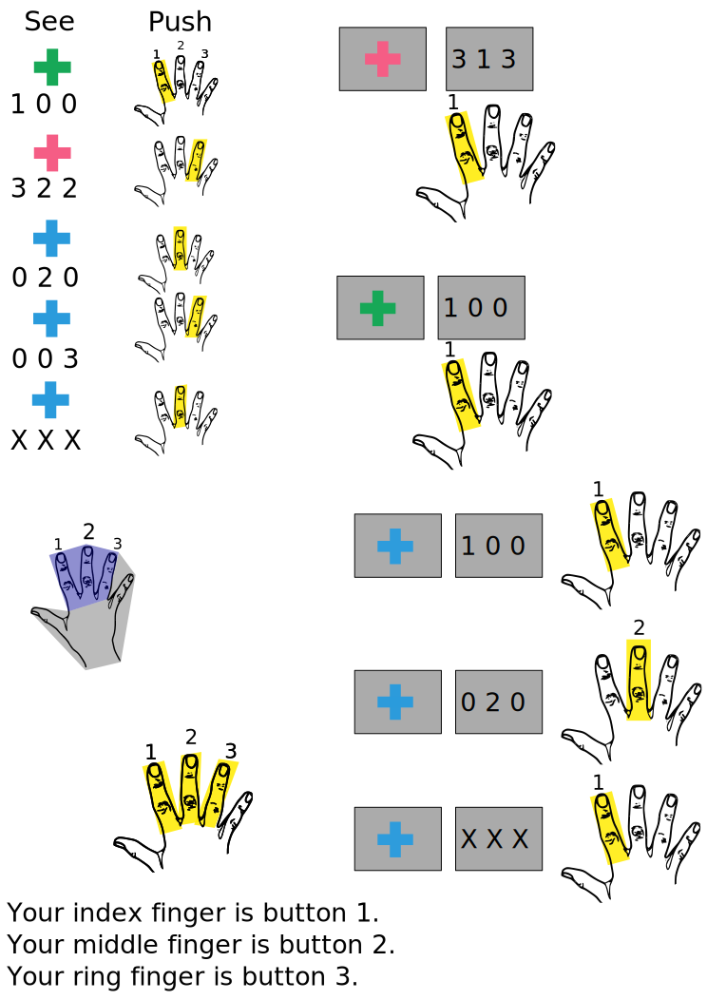

# n-Back Modified Multi-Source Interference Task
Task switching between interference/incongruent oddball selection and n-back congruent oddball selection/recall



## run
in `octave` or `matlab` with [`PTB`](http://psychtoolbox.org/download/). Use arrow keys to respond. For MRI and MEG hostnames hard coded in [`private/getSettings.m`](private/getSettings.m), use glove/buttonbox keys, keyboard numbers 1-3.

```matlab
nBMSI subjname 3

% SAME AS
subj='subjname' % subjectname for matfile
runtype=3       % 1=nback,2=interference,3=cong, >=4 mixed, >= 10 mix without nback

nBMSI(subj,runtype)
```

## Info
in matlab see `help nBMSI`, same as top of [`nBMSI`](nBMSI.m)

## Install
```matlab
% PTB
urlwrite('https://raw.github.com/Psychtoolbox-3/Psychtoolbox-3/master/Psychtoolbox/DownloadPsychtoolbox.m','DownloadPsychtoolbox.m')
DownloadPsychtoolbox
```

``` bash
# get task
git clone https://github.com/LabNeuroCogDevel/MMY4.git
cd MMY4
```

## Citations
* MSIT: http://www.nature.com/nprot/journal/v1/n1/full/nprot.2006.48.html
* PTB: ??

## transfer/copying
```bash
rsync -nrhi /mnt/usb/MMY4/ ~/src/MMY4 --size-only
```

## MR

### blocks
```
 ls /Volumes/L/bea_res/Data/Tasks/Switch_MMY4/MR/1*/20*/*mat|perl -lne 'print $& if m/_-?\d_/'|sort |uniq -c
     42 _-1_
     76 _1_
     43 _-2_
     76 _2_
     43 _-3_
     76 _3_
     76 _4_
     76 _5_
     76 _6_
     76 _7_
     76 _8_
     76 _9_
```

negative block numbers are "practice"

from `nBMSI.m`:
```
%  nBMSI 12345 congr
%  nBMSI 12345 nback practice % run nback, show extended instructions
%  nBMSI 12345 -1             % same as above
%  nBMSI 12345 congr practice Admin_PC % force MR computer, show more instructions 
%
% block type can be given as a string or number
%   1 - nback,nb, blue; 
%   2 - interference, int, red;
%   3 - congruent, cong, green;
%   4 - mix (mix1,mix2,mix3,mix4);
% negative numbers are practice of the positive number (imply 'practice')
%  - practice has sounds
%  - will stop early if accuracy is good
```

from `private/blockName2Num.m`
```
     case {'mix1','mix2','mix3',...
                 'mix4','mix5','mix6'}
       bn=str2double(blockname(4))+3;
```


### Timing
from `private/getSettings.m`
```
% number trials; 
s.events.nTrl    = 60; % 40 if cog+incog only (no nback); 35 for pure block

    s.time.Nback.wait=1.5;     s.time.Nback.cue=.5;
s.time.Interfere.wait=1.3; s.time.Interfere.cue=.5;
s.time.Congruent.wait=1;   s.time.Congruent.cue=.5;

s.time.ITI.max=Inf; s.time.ITI.min=1; s.time.ITI.end=12;

% fixation time should be about equal to task time
s.time.ITI.mu = mean([s.time.Nback.wait;
                     s.time.Interfere.wait;
                     s.time.Congruent.wait]) ...
                 + s.time.Nback.cue;
```

from output mat files:
```
mat_info <- function(f) {
  x <- R.matlab::readMat(f)
  data.frame(dur=(x$endtime - x$res[[1]][[1]][,,1]$idealonset)/60,
             ntrial=x$res[[length(x$res)]][[1]][,,1]$trl,
             id=stringr::str_extract(f, '\\d{5}_-?\\d'))
  
}
mats <- Sys.glob('/Volumes/L/bea_res/Data/Tasks/Switch_MMY4/MR/1*/20*/*mat')
d_info <- lapply(mats,\(x) tryCatch(mat_info(x),error=\(e) NULL)) |> bind_rows()
d_info |>
  separate(id,c('id','block')) |>
  mutate(block_trials=paste0(block,"_",ntrial)) |>
  group_by(block_trials) |>
  summarise(n(), mean(dur),sd(dur))
```

|block|trials | n() | mean(dur) | sd(dur)|
|-|----------|------|-----------|--------|
|1|35        |   80 |      2.39 | 0.0111 |
|2|35        |   76 |      2.28 | 0.00986|
|3|35        |   76 |      2.09 | 0.0249 |
|4|60        |   76 |      3.72 | 0.00926|
|5|60        |   76 |      3.73 | 0.0149 |
|6|60        |   76 |      3.73 | 0.0146 |
|7|60        |   76 |      3.73 | 0.0184 |
|8|60        |   76 |      3.73 | 0.0163 |
|9|60        |   76 |      3.73 | 0.0120 |


MR for 2 only (cog/incog, no n-back)
```
xx GOOD JOB @ 148.853
```


```
t=zeros(3,10); % inf, cog, mix
s = getSettings('init','Admin_PC'); % for MR timing
for i = 1:length(t),
 [e, emat] = genEventList(2) ;x=[e.onset]; t(1,i)=x(end)+12;
 [e, emat] = genEventList(3) ;x=[e.onset]; t(2,i)=x(end)+12;
 [e, emat] = genEventList(11);x=[e.onset]; t(3,i)=x(end)+12;
end

[min(t,[],2), mean(t,2), max(t,[],2)]


133.5735  135.3606  136.4175
122.2277  125.2909  126.5234
145.4405  147.3289  148.3090
```

```
iti=zeros(s.events.nTrlNoNbk+1,100); for i = 1:length(iti), iti(:,i) = genITI(s.events.nTrlNoNbk,s.time.ITI.mu,s.time.ITI.min); end
max(abs(sum(iti) - s.time.ITI.mu*(s.events.nTrlNoNbk+1)))
    0.0091
```

## EEG
psychtoolbox requires older octave 7.3 (not 9.4 as of 2025-02-28). Parallel port was using matlab with io64. But no octave mex? use 
### Downloads
#### LPT
 * https://www.highrez.co.uk/Downloads/InpOut32/default.htm
 * https://display-corner.epfl.ch/index.php?title=ParPulse
   * https://display-corner.epfl.ch/downloads/Octave73/parPulse.mex
 * http://web.archive.org/web/20210211055927/http://apps.usd.edu/coglab/psyc770/IO64.html

#### Octave
 * https://github.com/Psychtoolbox-3/Psychtoolbox-3/releases/tag/3.0.19.16
 * https://gnu.mirror.constant.com/octave/windows/octave-7.3.0-w64-installer.exe
 * https://gstreamer.freedesktop.org/data/pkg/windows/1.22.5/msvc/gstreamer-1.0-msvc-x86_64-1.22.5.msi
 * https://raw.githubusercontent.com/Psychtoolbox-3/Psychtoolbox-3/master/Psychtoolbox/PsychContributed/vcredist_x64_2015-2019.exe

```matlab
pkg install image statistics -forge
```
### Cedrus Button Box
buttons 1, 2, 3
```
waitForResp(GetSecs(),GetSecs(),1.5)
    raw = 176
    port = 0
    action = 1
    button = 6
    buttonID = right.inner
    rawtime = 12.088
    ptbfetchtime = 2.1646e+06
ans = Inf
>> waitForResp(GetSecs(),GetSecs(),1.5)
    raw = 208
    port = 0
    action = 1
    button = 7
    buttonID = right.center
    rawtime = 7.8080
    ptbfetchtime = 2.1646e+06
ans = Inf
>> waitForResp(GetSecs(),GetSecs(),1.5)
    raw = 16
    port = 0
    action = 1
    button = 1
    buttonID = right.outer
    rawtime = 0.2030
    ptbfetchtime = 2.1646e+06
```
